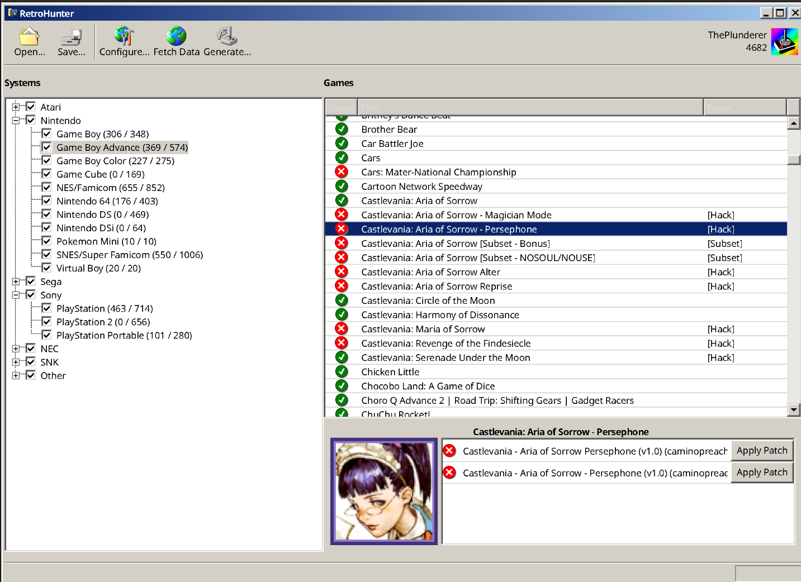

# RetroHunter

RetroHunter is a Desktop application that builds emulators rom sets by collecting games with [Retroachievements](http://retroachievements.org/).

RetroHunter is built using the C# [AvaloniaUI](https://avaloniaui.net/) framework with a Win 98 inspired theme thanks to the [Classic.Avalonia](https://github.com/BAndysc/Classic.Avalonia) package.

## Main Features

- Create rom sets based on available retro achievements
- Organize rom sets for easy integration with EmuDeck / Emulation Station folder structure
- Automatically download and apply patches to roms
- Compress disc based roms (iso) to best available format for each system (chd, rvz)

## Supported Platforms

- Windows
- Linux

## How it works

RetroHunter pulls games data and hashes from [Retroachievements](http://retroachievements.org/) and identifies Roms by following the Retroachievments [Games identification methods](https://docs.retroachievements.org/developer-docs/game-identification.html).

RetroHunter parses roms from an input folder and builds a roms set into a user defined output folder. The output folder structure can be configured to follow the [EmuDeck](https://www.emudeck.com/) roms folder structure, for easy transfer of games to the Steam Deck

## Supported systems

RetroHunter aims to support all game systems for which achievements are available on [Retroachievements](http://retroachievements.org/).

 
<b>Supported roms formats</b> 

| System                    | Rom format                         |
| ------------------------- | ---------------------------------- |
| Game Boy                  | .gb, .zip                          |
| Game Boy Color            | .gbc, .zip                         |
| Game Boy Advance          | .gba, .zip                         |
| Nes                       | .nes, .fds, .zip                   |
| Snes                      | .sfc .smc .zip                     |
| Nintendo 64               | .d64, .ndd, .n64, .v64, .z64, .zip |
| GameCube                  | .iso                               |
| NindendoDS                | .nds, .zip                         |
| Pokemon Mini              | .min, .zip                         |
| Virtual Boy               | .vbs, .zip                         |
| PlayStation               | .cue, .iso, .chd                   |
| PlayStation 2             | .iso, .chd                         |
| Psp                       | .iso, .chd                         |
| Atari2600                 | .a26, .zip                         |
| Atari7800                 | .a78, .zip                         |
| Atari Jaguar              | .j64, .rom, .zip                   |
| Atari Jaguar CD           | .cue, .chd                         |
| Atary Lynx                | .lyx, .zip                         |
| SG-1000                   | .sg                                |
| Master System             | .sms, .zip                         |
| Game Gear                 | .gg, .zip                          |
| Genesis                   | .md, .zip                          |
| Sega CD                   | .cue, .chd                         |
| Sega 32X                  | .32x, .zip                         |
| Saturn                    | .cue, .chd                         |
| Dreamcast                 | .iso, .chd                         |
| PC Engine                 | .pce, .zip                         |
| PC Engine CD              | .cue, .iso                         |
| PC-8000/8800              | .88d, .cmt, .d88, .t88, .u88, .zip |
| PC-FX                     | .cue, .chd                         |
| NeoGeo CD                 | .cue, .chd                         |
| NeoGeo Pocket             | .ngp, .ngc, .zip                   |
| 3DO                       | .cue, .chd                         |
| Amstrad CPC               |                                    |
| Apple II                  | .ar2, .woz, .zip                   |
| Arcade                    | .zip                               |
| Arcadia 2001              | .bin, .zip                         |
| Arduboy                   | .hex, .bin                         |
| ColecoVision              | .col                               |
| Elektor TV Games Computer |                                    |
| Fairchild Channel F       | .bin, .zip                         |
| Intellivision             | .int, .zip                         |
| Interton VC 4000          | .bin, .zip                         |
| Magnavox Odyssey2         | .bin, .zip                         |
| Mega Duck                 | .bin, .zip                         |
| MSX                       | .rom, .zip                         |
| Uzebox                    |                                    |
| Vectrex                   | .vec, .zip                         |
| Supervision               | .sv, .zip                          |
| WonderSwan                | .ws, .wsc, zip                     |
| Wasm4                     |                                    |

## How to build

RetroHunter requires .NET 10.0 and can be build on Windows and Linux (Verify Mac OS support).

## TODOs

### Main features
- [ ] Read roms from extra folder (!= input dir)
- [ ] Cleanup tool to remove broken (missing files) or corrupted roms
- [ ] Configuration Wizard when opening for 1st time
- [ ] Auto downloader for chdman / dolphin tool exes
- [ ] Launchbox / other FE folder structure support
- [ ] Multithreaded matchers
- [ ] Final detailed report of added removed roms
- [ ] Global report on roms found / missing
- [ ] Batch compression tool
- [ ] Command to remove existing rom
- [ ] Support PS2 CHD reading (Raw ISO filesystem on DVD)

### UI Features
- [ ] Classic MS Explorer download animation for data fetching
- [ ] Finalize icons for systems

### Extra features
- [ ] Implement github actions to build, test and release
